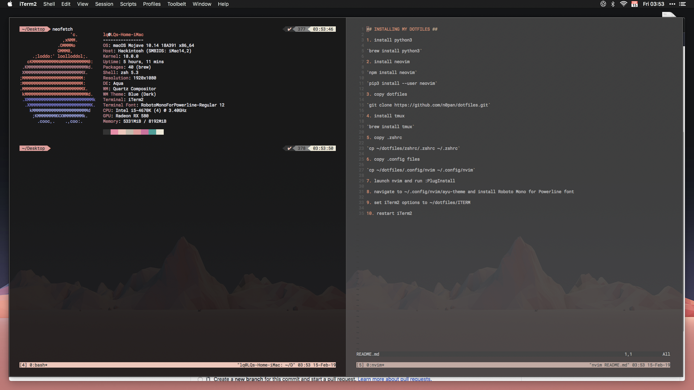

## INSTALLING MY DOTFILES ##

1. install python3

`brew install python3`

2. install neovim

`npm install neovim`

`pip3 install --user neovim`

`brew install neovim`

4. install PlugInstall

`curl -fLo ~/.local/share/nvim/site/autoload/plug.vim --create-dirs \
    https://raw.githubusercontent.com/junegunn/vim-plug/master/plug.vim`

5. copy dotfiles

`git clone https://github.com/n0pan/dotfiles.git`

6. install tmux

`brew install tmux`

7. copy .zshrc

`cp ~/dotfiles/zshrc/.zshrc ~/.zshrc`

8. copy .config files

`cp ~/dotfiles/.config/nvim ~/.config/nvim`

9. launch nvim and run :PlugInstall

10. navigate to ~/.config/nvim/ayu-theme and install Roboto Mono for Powerline font

11. set iTerm2 options to ~/dotfiles/ITERM

12. install fontforge

`brew install fontforge`

13. clone ligaturizer

`git clone https://github.com/ToxicFrog/Ligaturizer.git --recurse-submodules`

14. ligaturize `SF Mono` and set as font everywhere

15. ???

16. profit!

